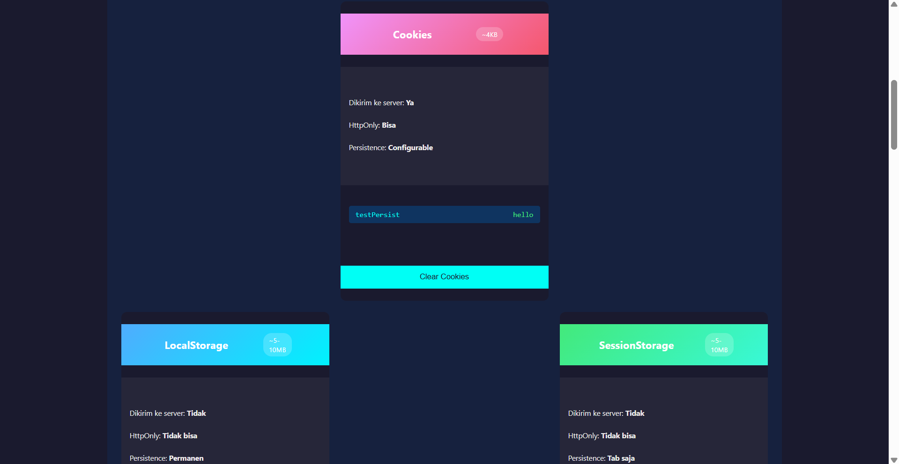
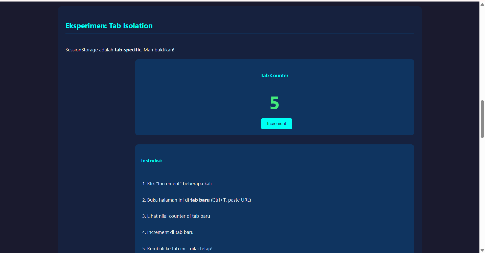
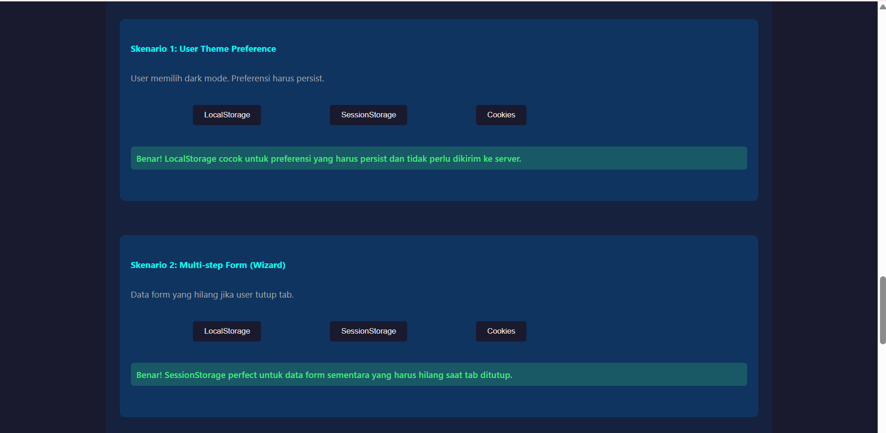
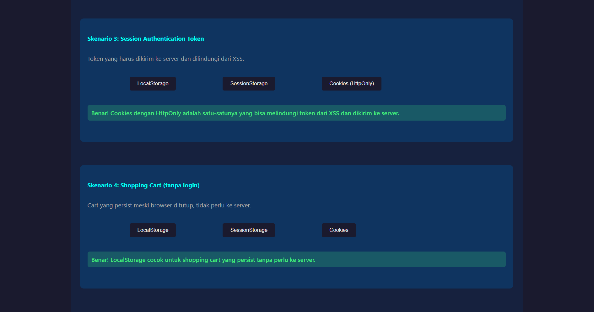

Eksperimen 1:
- Cookies: [masih ada / hilang] masih ada
- LocalStorage: [masih ada / hilang] masih ada
- SessionStorage: [masih ada / hilang] masih ada

Eksperimen 2:
Catat: Berapa nilai counter di tab baru? 0
Catat: Berapa nilai counter di tab lama? 5
Kesimpulan:
SessionStorage adalah tab-isolated (tab-shared / tab-isolated)

Eksperimen 3:
- Cookies: ~4KB
- LocalStorage: ~5-10MB
- SessionStorage: ~5-10MB

Eksperimen 4:
Skenario 1: Karena LocalStorage cocok untuk preferensi yang harus persist dan tidak perlu dikirim ke server.
Skenario 2: Karena SessionStorage perfect untuk data form sementara yang harus hilang saat tab ditutup.
Skenario 3: Karena Cookies dengan HttpOnly adalah satu-satunya yang bisa melindungi token dari XSS dan dikirim ke server.
Skenario 4: Karena LocalStorage cocok untuk shopping cart yang persist tanpa perlu ke server.

1. Mengapa Session Token TIDAK Boleh di LocalStorage?
LocalStorage tidak mendukung atribut HttpOnly, sehingga jika terjadi serangan XSS sedikit saja, penyerang bisa langsung mencuri token tersebut menggunakan perintah JavaScript sederhana. Berbeda dengan cookie yang bisa diproteksi, LocalStorage membiarkan data sensitif Anda terbuka lebar untuk skrip jahat mana pun yang berhasil masuk.

2. Keuntungan SessionStorage untuk Multi-step Form
SessionStorage bersifat terisolasi per tab dan akan terhapus otomatis saat tab ditutup, sehingga data formulir tidak akan saling "bertabrakan" jika pengguna membuka dua tab berbeda untuk transaksi yang berbeda. Selain itu, ini mencegah data formulir lama yang belum selesai menghantui pengguna saat mereka kembali ke situs di lain waktu.

3. Storage untuk Todo List Offline-First: IndexedDB
Saya akan menggunakan IndexedDB karena kapasitas penyimpanannya sangat besar (ratusan MB hingga GB) dan mendukung kueri data yang kompleks (indeks dan pencarian), yang sangat krusial untuk aplikasi offline-first. IndexedDB memungkinkan aplikasi tetap responsif dan menyimpan ribuan tugas meskipun tanpa koneksi internet, jauh melampaui limit 5MB milik LocalStorage.

Gunakan Cookie (dengan fitur keamanan) khusus untuk menyimpan kunci login supaya akunmu tidak gampang dibajak, sementara LocalStorage cocok untuk menyimpan setelan yang ingin kamu simpan selamanya, seperti pilihan Dark Mode. Kalau hanya ingin menyimpan data sementara agar tidak hilang saat halaman di-refresh (tapi hilang saat tab ditutup), pakailah SessionStorage. Terakhir, jika kamu membuat aplikasi berat yang butuh menyimpan banyak data secara offline, gunakan IndexedDB karena kapasitasnya paling besar dan sangat fleksibel.